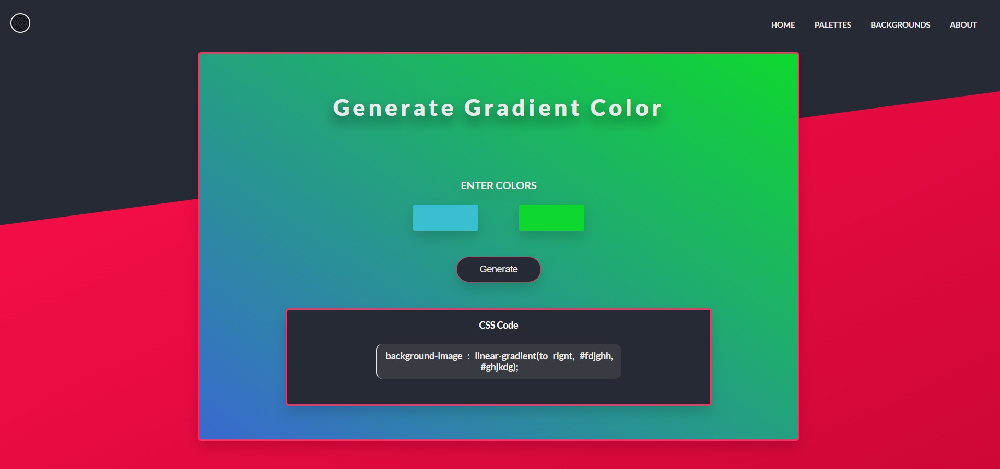

# Gradient Background Generator

##### See Live : https://pratyushranjanpadhi.github.io/Gradient-Background-Generator/

\
\
This is a simple app that lets you generate CSS code for gradient background.

-  You can choose gradient on the go and check the look
-  You can even choose the orientation

Gradient background generator takes in two color input which you can check on the go while changing the colors and you can also choose the orientation or the gradient and based on that it generates the CSS background-image code

> Gradient background generator takes in two color input
> which you can check on the go while changing the colors
> colors and you can also choose the orientation or the gradient
> or the gradient and based on that it
> generates the CSS background-image code

### Tech-Stack

-  HTML 5
-  CSS 3
-  Vannila Javascript

### _You can see the preview below_

